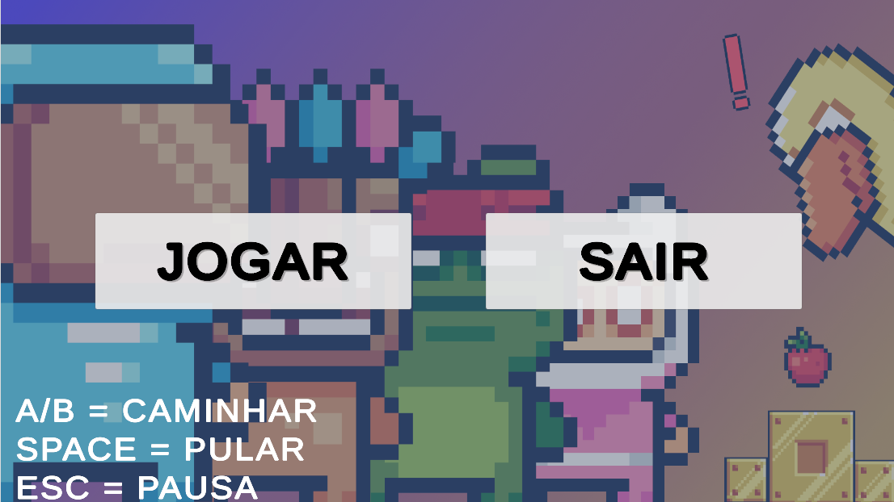
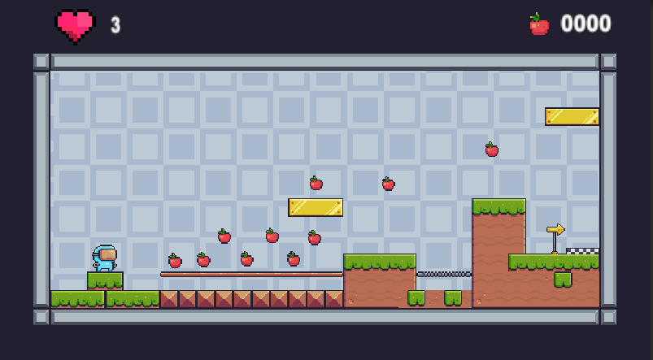
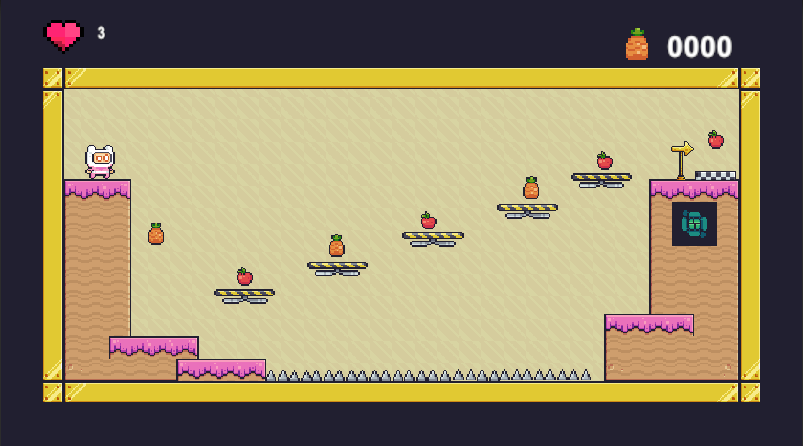
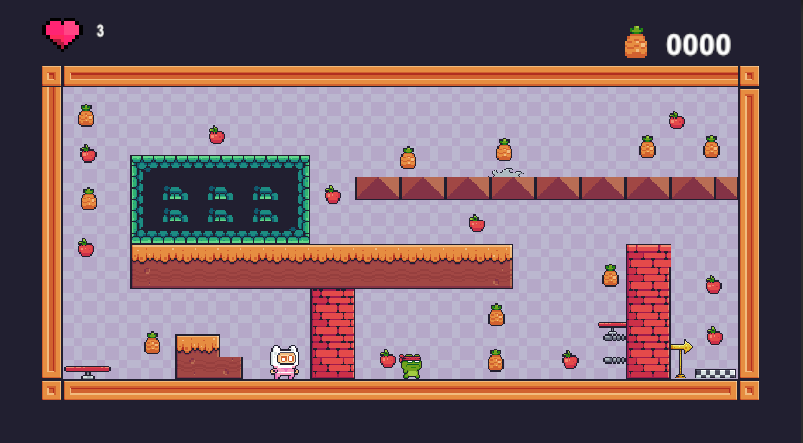
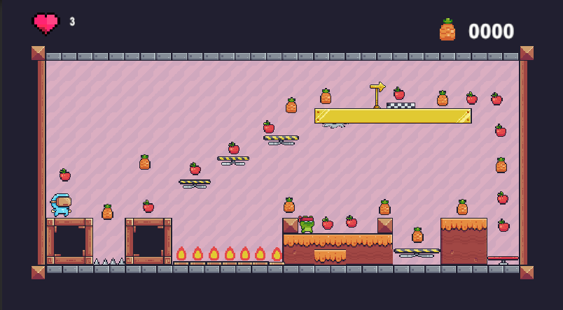
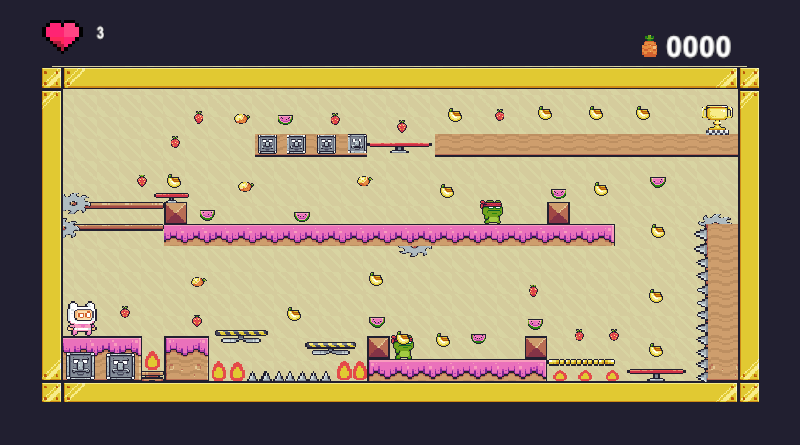
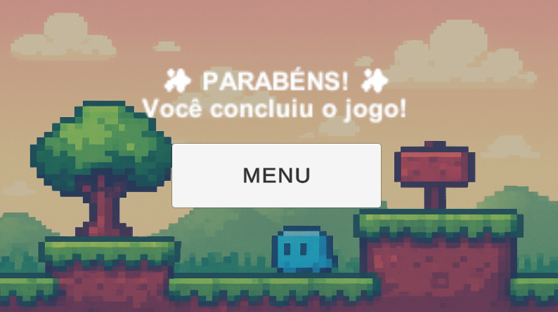

# 🎮 Pixel Quest: The Fruit Islands — Plataforma 2D

Um jogo de plataforma 2D desenvolvido em Unity, com foco em aventura, coleta de frutas, obstáculos, precisão e progressão por fases.

**Este repositório contém:**

- Código-fonte completo (C#)

- Sprites, áudios e demais assets utilizados

- Prints das telas e níveis

- README com descrição, mecânicas, controles e instruções de execução

## 📁 Estrutura do Repositório

```Assets/
 ├── Animations/
 ├── Background/
 ├── Pixel Adventure 1/
 ├── Prefabs/
 ├── Scenes/
 │    ├── level_1
 │    ├── level_2
 │    ├── level_3
 │    ├── level_4
 │    ├── level_5
 │    ├── Menu
 │    └── TelaEnd
 └── Scripts/
      ├── EndVitoria.cs
      ├── FallingPlatform.cs
      ├── Frog.cs
      ├── Fruit.cs
      ├── GameController.cs
      ├── MenuPrincipalManager.cs
      ├── MusicController.cs
      ├── NextLevelPoint.cs
      ├── Player.cs
      ├── PlayerLife.cs
      ├── Saw.cs
      └── Trampoline.cs
```

## 🌴 Descrição do Jogo

Pixel Quest: The Fruit Islands é um jogo de plataforma 2D em que o jogador percorre ilhas místicas, coletando frutas mágicas, desviando de armadilhas, derrotando inimigos e avançando por fases até alcançar a vitória final.

O jogo inclui:

- 🎨 Pixel art estilizada

- 🎵 Música ambiente e efeitos sonoros

- 🕹️ Mecânicas clássicas de plataforma

- 🚧 Obstáculos, quedas, trampolins, serrotes e plataformas móveis

- 🏝️ Progressão automática ao tocar no ponto final

## ⚙️ Mecânicas do Jogo
### ✔ Movimento do Jogador

- Andar (A/D ou setas ← / →)

- Pular (Espaço)

- Colisão e física 2D

- Morte ao cair do mapa

### ✔ Obstáculos

- Plataformas temporárias

- Serrotes/ Fogo / Espinhos

- Inimigo Frog

- Trampolim

- Fruits (coletáveis)

### ✔ Progressão de Fases
- Menu (JOGAR & SAIR)

- Cada fase possui um NextLevelPoint ao tocar, carrega a próxima cena (nível)

- Cena final de vitória: TelaEnd

### ✔ Sistema de Vida

1. Gerenciado pelo script PlayerLife

2. Perde vida ao tomar dano

3. Reinicia fase ao chegar a 0

## ⌨️ Teclas utilizadas durante o jogo

| Ação | Tecla |
|------|--------|
| Mover | A / D |
| Pular | Espaço |


## 🖥️ Como Executar o Jogo
*👉 1. Baixar a Build*

Baixe o arquivo compactado:
``PixelQuestFruitIslands_Build.zip``

*👉 2. Extrair*

``Clique com o botão direito → Extrair aqui``

*👉 3. Executar*

Abra:
Pixel Quest The Fruit Islands.exe``

Pronto! O jogo inicia sem instalação.

## 🔧 Como Rodar o Projeto na Unity

Abra Unity Hub

Clique em ``Open Project``

``Selecione a pasta do repositório``

Aguarde carregar todos os assets

Vá em:

``Assets/Scenes/Menu.unity``


Clique em *JOGAR*

## 🧑‍💻 Tecnologias Utilizadas

- Unity (2D Core)

- C#

- Tilemap

- Rigidbody2D

- Colliders

- Animator Controller

- Audio Source / Audio Clip


## 🏁 Status do Projeto

✔ Jogo funcional
✔ Fases criadas
✔ Scripts implementados
✔ Sistema de vida
✔ Progressão entre níveis
✔ Tela de vitória

## 🎨 Vem conhecer comigo um pouco da interface gráfica de cada nível

### Menu


### Level 1


### Pausa do jogo
![Tela pausa do jogo] (Prints/PAUSA.png)

### Level 2


### Level 3


### Level 4


### Level 5


### Tela Final


---
MIT License

Copyright (c) 2025 Pâmela Xisto Santos